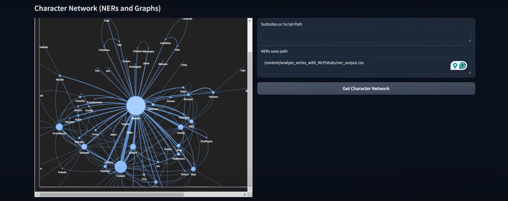
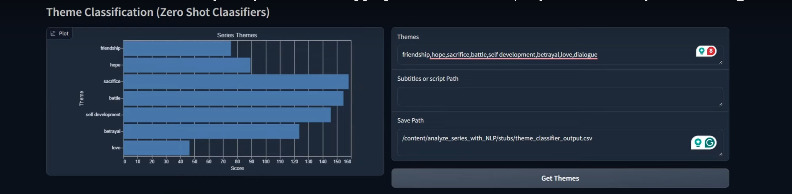
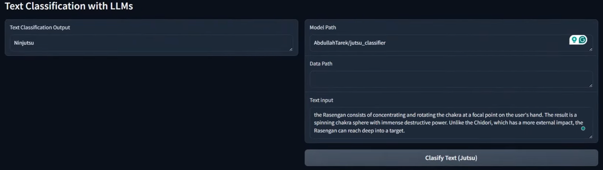
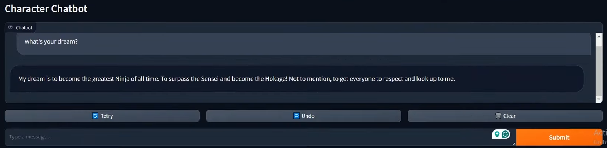

# Naruto Series Analysis Using NLP and LLMs

## Introduction

Naruto is a popular Japanese anime series that follows the journey of Naruto Uzumaki, a young ninja striving to become the strongest leader of his village, the Hokage. The series is renowned for its complex characters, captivating story arcs, diverse jutsus (ninja techniques), and deep themes of perseverance, friendship, and power struggles. With a large cast of characters and intricate narratives, it can be challenging for fans to fully grasp all the interrelationships and themes that make Naruto unique.

This project aims to analyze Naruto using advanced NLP (Natural Language Processing) techniques and LLMs (Large Language Models). By leveraging techniques such as theme classification, named entity recognition (NER), and character-based chatbots, this project provides a fresh perspective on the series. It allows enthusiasts to explore and interact with the Naruto universe in new ways, deepening their understanding of the story and its characters. With a focus on creating intuitive visualizations and interactive tools, this project also serves as an excellent showcase of NLP capabilities that can be applied to analyze any complex narrative-driven content.


## Tech Stack

This project leverages a comprehensive set of libraries and frameworks to create an interactive and efficient chatbot experience based on the Naruto anime. Each component of the tech stack plays a crucial role in different aspects of the project:

- **NLTK (Natural Language Toolkit)**: Used for text processing and natural language understanding tasks. NLTK helps in tokenization, stemming, and other linguistic preprocessing tasks to ensure the input data is clean and suitable for model training.

- **Pandas**: A powerful data manipulation library that facilitates data loading, cleaning, and analysis. It is used to handle the Naruto dialogue dataset, perform operations such as filtering and transformation, and prepare the data for model training.

- **Transformers**: A library by Hugging Face that provides state-of-the-art pre-trained models for various natural language processing tasks. In this project, Transformers are used to implement and fine-tune language models for generating responses in the chatbot.

- **Hugging Face Hub**: Utilized to access and manage pre-trained models hosted on the Hugging Face Model Hub. This simplifies the process of model sharing and deployment, allowing for seamless integration of new models into the chatbot.

- **Torch (PyTorch)**: A deep learning framework that underpins the training and inference of models. PyTorch provides the flexibility needed for custom model architectures and facilitates GPU acceleration for efficient computation.

- **Scikit-learn (sklearn)**: Used for various machine learning tasks, including performance evaluation and model selection. Scikit-learn helps in computing metrics and performing cross-validation during the training process.

- **Datasets**: A library that simplifies the process of loading, preprocessing, and managing datasets for machine learning. This project uses Datasets to handle the Naruto dialogue data efficiently, allowing for easy manipulation and integration with Hugging Face models.

- **GC (Garbage Collection)**: Employed to manage memory usage and optimize resource allocation during model training. By explicitly invoking garbage collection, the project ensures that unnecessary objects are freed, reducing the likelihood of memory leaks.

- **Evaluate**: This library is used for evaluating model performance based on various metrics. It simplifies the process of calculating evaluation metrics, providing a streamlined approach to performance assessment.

- **BeautifulSoup (bs4)**: A library for parsing HTML and XML documents. In this project, BeautifulSoup is used to clean and preprocess raw text data, removing HTML tags and extracting meaningful content from web-scraped data.

- **Scrapy**: A powerful web scraping framework that allows for efficient data extraction from websites. It is used to gather additional data for training and enrich the chatbot's knowledge base with dialogues and scenarios from the Naruto universe.

- **spaCy**: An advanced library for natural language processing that provides functionalities such as named entity recognition and dependency parsing. spaCy enhances text processing capabilities, ensuring that the chatbot can understand complex language structures.

- **AST (Abstract Syntax Tree)**: Used for parsing and analyzing Python code structures. In this project, AST may be employed for code analysis tasks, allowing for better understanding and manipulation of Python scripts.

- **Pyvis**: A library for visualizing networks and graphs in Python. It can be used to create visual representations of relationships between characters, jutsu, and other elements in the Naruto series, enhancing user engagement through visual storytelling.

- **NetworkX**: A library for the creation, manipulation, and study of complex networks. NetworkX is useful for modeling relationships and interactions within the Naruto universe, enabling the visualization of character networks and their connections.

- **PEFT (Parameter-Efficient Fine-Tuning)**: This technique is utilized to fine-tune pre-trained models efficiently, reducing resource requirements while maintaining performance. PEFT allows the chatbot to adapt to the unique speech patterns and character traits of Naruto.

- **TRL (Training Reinforcement Learning)**: A framework used for training models with reinforcement learning techniques. In this project, TRL is leveraged to enhance the chatbot's conversational abilities, making it more responsive and engaging during interactions.

- **Re (Regular Expressions)**: Employed for pattern matching and text manipulation tasks. Regular expressions are used to clean and preprocess dialogue data, ensuring that the input for training the model is well-structured and free of unnecessary characters.

This diverse tech stack allows for the development of a sophisticated and interactive Naruto chatbot, combining state-of-the-art machine learning techniques with robust data processing capabilities.

## Project Overview

In this project, we have built multiple models, each dedicated to a specific aspect of analyzing the series. The complete analysis is presented through an interactive web GUI created using Gradio. The core components of the project are:

### 1. **Web Crawler**
The `crawler` folder contains the `jutsu_crawler.py` script for web scraping data from the Naruto fandom wiki. This crawler systematically collects detailed information about jutsus (ninja techniques) and their descriptions, forming a foundational dataset for further analysis.

#### **`jutsu_crawler.py`**
This script uses the Scrapy framework to navigate through pages of jutsus, extracting relevant information and saving it as a JSON Lines file.

- **Key Features**:
    - **Scraping Jutsu Data**: The crawler begins at a specified URL containing a list of jutsus and iterates through the pages to gather individual jutsu details. Each jutsu's name, type, and description are extracted from its dedicated page.
    - **Data Extraction**:
        - **Jutsu Name**: Retrieved from the page title.
        - **Jutsu Type**: Extracted from the jutsu's metadata, if available.
        - **Jutsu Description**: Cleansed of extraneous sections (e.g., trivia) to provide a clear summary.
    - **How to Run the Crawler**: To execute the crawler, run the following command in the terminal:
    ```bash
        scrapy runspider crawler/jutsu_crawler.py -o data/jutsus.jsonl
    ```

### 2. **Character Network**
The `character_network` folder includes two main scripts:

#### **`char_net_generator.py`**
This script generates a character relationship network based on Named Entity Recognition (NER) outputs. It analyzes the entities extracted from the scripts and constructs a relationship graph to visualize character interactions and connections.
  
  - **Key Functions**:
    - `generate_character_network(df)`: Constructs a DataFrame of character relationships based on co-occurrences within a sliding window of sentences. It captures how often characters appear together, ensuring uniformity in relationships by sorting pairs.
    - `draw_network_graph(relationship_df)`: Utilizes the NetworkX and PyVis libraries to create and visualize the character network, generating an interactive HTML representation.

  

#### **`named_entity_recognizer.py`**
This script is responsible for extracting named entities from the subtitles using the SpaCy NLP library. It identifies characters' names and returns them as a set of unique entities.

  - **Key Functions**:
    - `get_ners_inference(script)`: Processes each sentence in the script to identify named entities labeled as "PERSON" and returns them as a list.
    - `get_ners(dataset_path, save_path=None)`: Loads the subtitle dataset, performs NER on each script, and saves the results if a save path is provided. If the results are already saved, it retrieves them for efficiency.

### 3. **Theme Classifier**
The `theme_classifier.py` module includes the implementation of a zero-shot classification model in `theme_classifier.py`. This model categorizes themes in the Naruto series, such as "friendship," "betrayal," "revenge," and "redemption," based on textual descriptions from subtitles. 

**Key Features:**
- Utilizes the `facebook/bart-large-mnli` model to perform inference on script segments. 
- Processes the input scripts, tokenizes them, and batches sentences for efficient theme detection. 
- Saves resuls in a DataFrame, providing insights into narrative structures that drive the story.

   

### 4. **Text Classification**
This module focuses on the classification of jutsus using pre-trained language models.

#### Jutsu Classifier
The `jutsu_classifier.py` module implements a Jutsu Classifier that utilizes the Hugging Face Transformers library. It processes jutsu data and trains a model to classify jutsus into predefined categories.

**Key Features:**
- Loads and trains a transformer model for jutsu classification.
- Preprocesses data to clean and tokenize text.
- Utilizes custom metrics for model evaluation.

   

#### Custom Trainer
The `custom_trainer.py` module extends the Trainer class from the Transformers library, allowing for customized training processes, including the computation of class weights for balanced loss calculations.

**Key Features:**
- Implements custom loss functions.
- Allows setting class weights for imbalance handling.

#### Training Utilities
The `training_utils.py` module provides utility functions for computing class weights and metrics during model evaluation.

**Key Features:**
- Computes class weights to address class imbalance.
- Evaluates model predictions using accuracy metrics.

#### Text Cleaner
The `cleaner.py` module is responsible for cleaning and preprocessing text data to ensure that the input data for the model is in an optimal format.

**Key Features:**
- Removes HTML tags and unnecessary formatting.
- Cleans text data to improve model performance.

### 5. **Character Chatbot**
   The `character_chat_bot` module contains the code for creating a character chatbot using LLMs. This allows fans to engage in conversation with their favorite characters. This model is built on advanced transformer architectures and utilizes fine-tuning to replicate the personality and speech patterns of Naruto. The chatbot is capable of engaging in dialogues, responding to user inputs in a manner consistent with Naruto's character. It is built using the Hugging Face Transformers library and leverages techniques like quantization and parameter-efficient fine-tuning to optimize performance.

   

#### Usage
##### **Initializing the ChatBot**
You can create an instance of the CharacterChatBot class as follows:

```python
from character_chatbot import CharacterChatBot
chatbot = CharacterChatBot(model_path="your_huggingface_model_path")
```
###### **Parameters:**
- `model_pat`: Path to the pretrained model on Hugging Face Hub or a local directory.
- data_path: (Optional) Path to the dataset file. Default is ../data/naruto.csv.
- huggingface_token: (Optional) Your Hugging Face token for accessing private models.

##### T**raining the Model**
If the specified model is not found, the bot will automatically train a new model using the dataset provided. The dataset must contain dialogues relevant to Naruto.

##### **Chatting with the Bot**
To chat with the chatbot, use the chat method. This method takes the user's message and maintains a conversation history.
```python
history = []  # List to hold conversation history
response = chatbot.chat(message="How are you?", history=history)
history.append((message, response))
```
###### **Parameters:**
- `message`: A string containing the user's input.
- `history`: A list of tuples, where each tuple contains a user message and the corresponding assistant's response.

#### Methods
- `load_model(model_path)`: Loads the model from the specified path. If the model is in a quantized format, it configures the model accordingly.
- `train(base_model_name_or_path, dataset, ...)`: Trains the model using the provided dataset and configuration settings.
- - `base_model_name_or_path`: The base model to fine-tune.
- - `dataset`: The dataset to use for training.
- - Additional parameters can be adjusted to control training behavior, such as batch size, learning rate, and gradient accumulation steps.
- `load_data()`: Loads the dialogue data from the specified CSV file and processes it into a format suitable for training.
- `remove_paranthesis(text)`: A utility function that removes unnecessary parentheses from the dialogue text.

   
## Gradio Web Interface

All the models are integrated into an intuitive Gradio web interface, making it easy for users to interact with the project outputs. The Gradio GUI consists of four main sections:
1. **Theme Classifier**: Users can input episode summaries or character dialogues to see the main themes extracted by the model.
2. **Character Network**: Visualizes the network of characters and their relationships based on NER outputs.
3. **Jutsu Classifier**: Input battle scenes or jutsu descriptions to see the categorization of techniques.
4. **Character Chatbot**: Chat with your favorite Naruto characters to get insights into their personalities and motivations(Model only trained for Naruto right now).

## How This Project Enhances Understanding

Through this project, Naruto fans can:
- **Analyze Themes**: Identify overarching themes and gain a deeper appreciation of the narrative structure.
- **Visualize Relationships**: Explore a complex character network that reveals hidden connections and rivalries.
- **Categorize Jutsus**: Learn more about the techniques used in battles and their significance.
- **Interact with Characters**: Engage with Naruto characters to simulate dialogues and understand their motivations.

This multi-faceted analysis serves as a comprehensive toolkit for anime enthusiasts, aspiring data scientists, and NLP practitioners alike, enabling them to explore Naruto and similar series in innovative ways.

## Installation Requirements

Before running any code in this project, make sure you have installed all required packages. Navigate to the project folder and execute:

```bash
pip install -r requirements.txt
```

## How to run the app?

In the base directory, oprn terminal and run:
```bash
python gradio.py
```

# THANKS FOR READING !!!!

